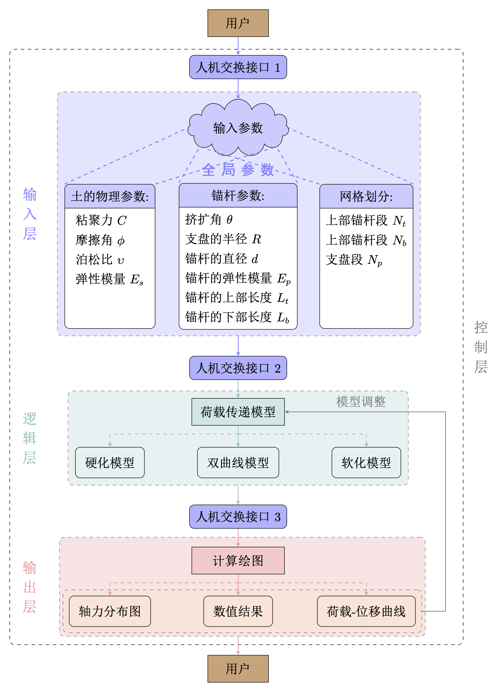

支盘式锚杆拉拔荷载传递非线性分析软件主要由控制层、输入层、逻辑层和输出层4部分组成。

  

{}
控制层实现用户对软件主界面进行操作的功能，通过主界面菜单栏支持对荷载模型选择界面、输入参数界面、软件使用帮助界面以及数值计算和绘制曲线图的运算界面的调用。
{}

{}
输入层是实现用户与软件进行信息交互的途径。该软件的输入层将土的物理参数（粘聚力、摩擦角、弹性模量以及泊松比等）、支盘式锚杆参数（挤扩角、支盘半径以及锚杆弹性模量等）和网格划分参数三方面进行赋值。对用户未经实测而无法确定的参数，用户可对照本区域类似工程的地质和设计参数进行比较后确定。
{}

{}
逻辑层是支盘式锚杆拉拔荷载传递非线性分析软件的重要部分，其核心内容是荷载传递模型（双曲线模型、硬化模型以及软化模型等）的选择。在实际工程中可根据具体情况灵活选择不同的荷载传递模型。
{}

{}
输出层包含模型计算、数值结果的输出和绘图（荷载-位移曲线、沿轴向深度的轴力分布图）的输出三部分，其中模型计算采用分段变形协调迭代算法。
{}

