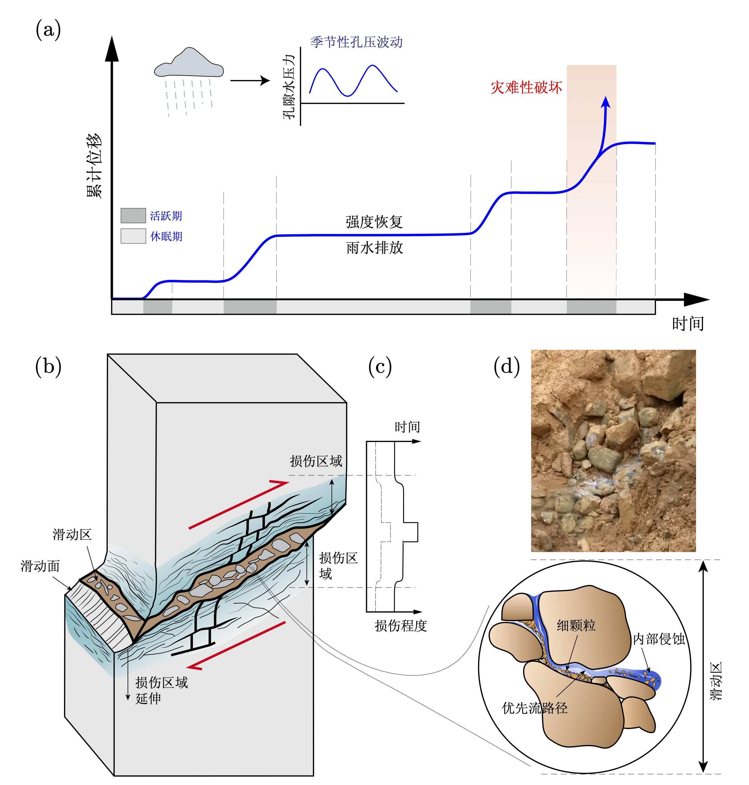

尧山滑坡位于福建省安溪县，距西坪镇以东约 8 km,属构造侵蚀中低山地貌区。滑坡体位于山坡中前段的坡麓部，地势起伏显著，地形高程为 350～472 m。滑坡整体呈典型“舌状”形态，由后缘至前缘依次表现为缓坡-陡坡组合结构，主滑动方向为N10°E，整体坡度约 20°～30°。

  

为实现滑坡多物理场的长期动态监测，于 2019 年 8 月在滑坡主滑带中部区域(MS-1、MS-2)建立了自动化监测平台1.0，于 2023 年 6 月升级完成为2.0。系统平台集成了雨量计、孔隙水压力计、阵列式倾斜仪与水位计等多类型传感器。各传感器以 1 h为时间间隔自动采集数据，并通过无线网络实时传输至远程监测服务器。

  

{}
通过长期的原位监测实现尧山滑坡整体的三维变形可视化，揭示了滑坡变形的时空动态特征，并将滑坡划分为牵引变形区、主滑区以及阻滑区。滑坡区滑面孔隙压力在地下水补给的季节性变化下会发生周期性波动，导致以加速-减速阶段为特征的间歇性运动。这一运动模式由滑动面形态、复杂的地下水文系统和地质结构特征的相互作用所控制。
{}

  

{}
研究表明，岩层中的碗状特征可能是尧山滑坡运动的诱因之一。该特征的形成归因于岩层的低渗透性，降雨渗透被截留并快速累积在碗状区域，导致孔隙水压力在滑动带内聚集，进而可能引发滑坡运动。这些关键特征通常容易在基于钻孔解释的岩性剖面中被忽视。
{}

  

{}
研究定义了低速剪切波异常区为潜在优势水文通道，推测滑坡体内至少存在两种地下水循环模式：一种为降雨优先渗透并流向由大孔隙、裂缝和土壤管道组成的高渗透性网络；另一种为通过沟壑侵蚀通道直接流向滑坡体的滑动带附近。这些优势水文通道能够在短时间内显著改变滑坡体的水力条件，从而激活滑坡的运动。
{}

  

  

