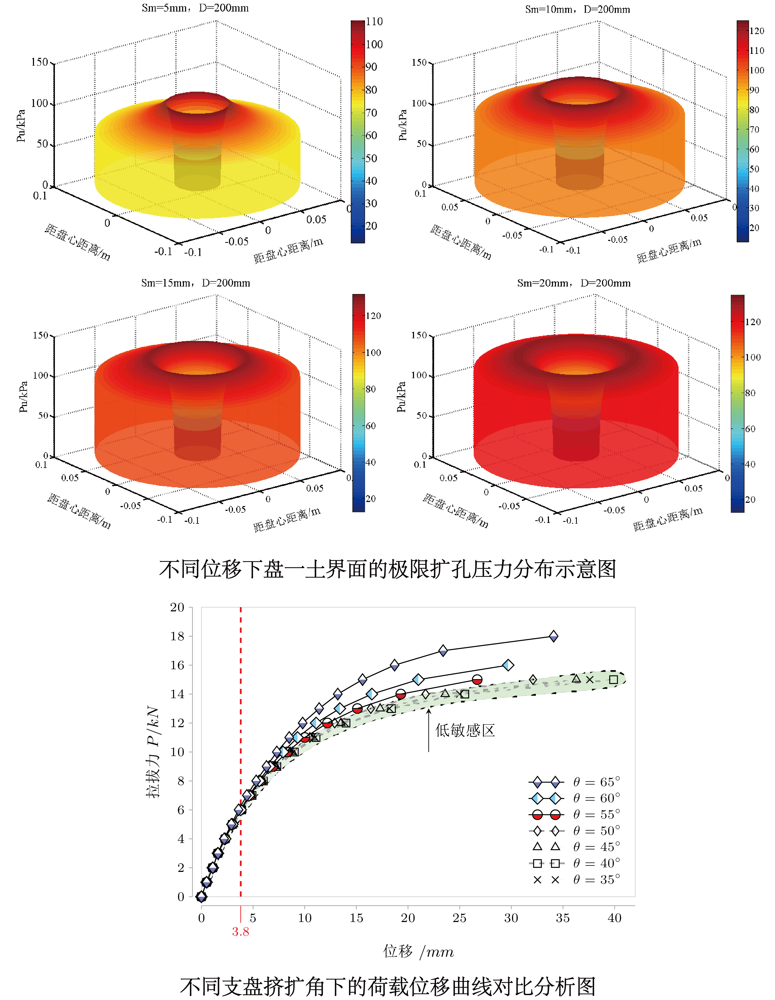
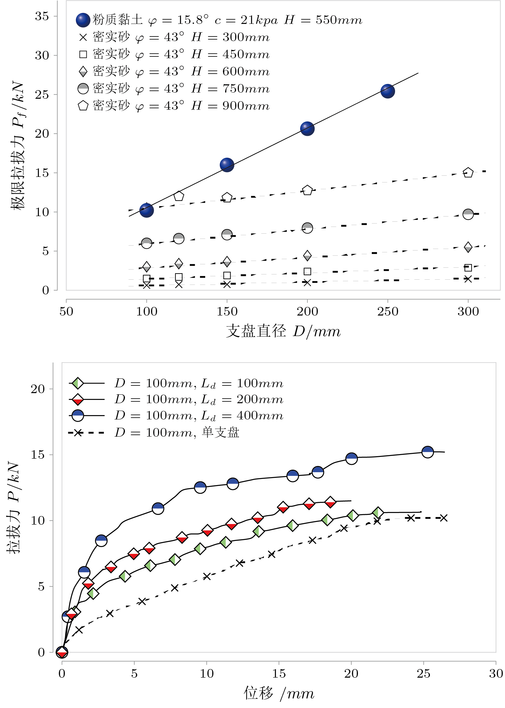
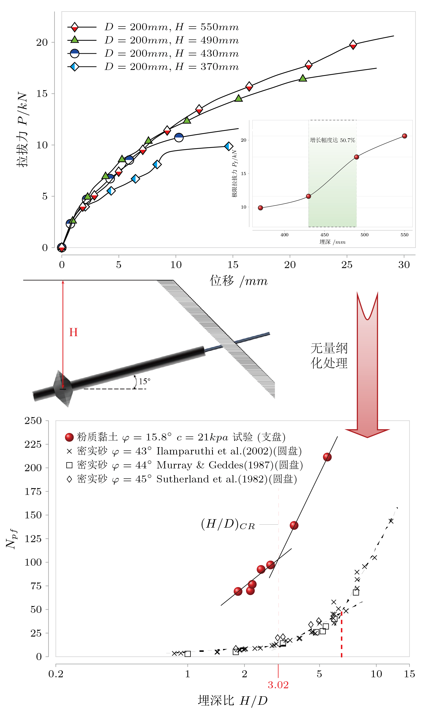
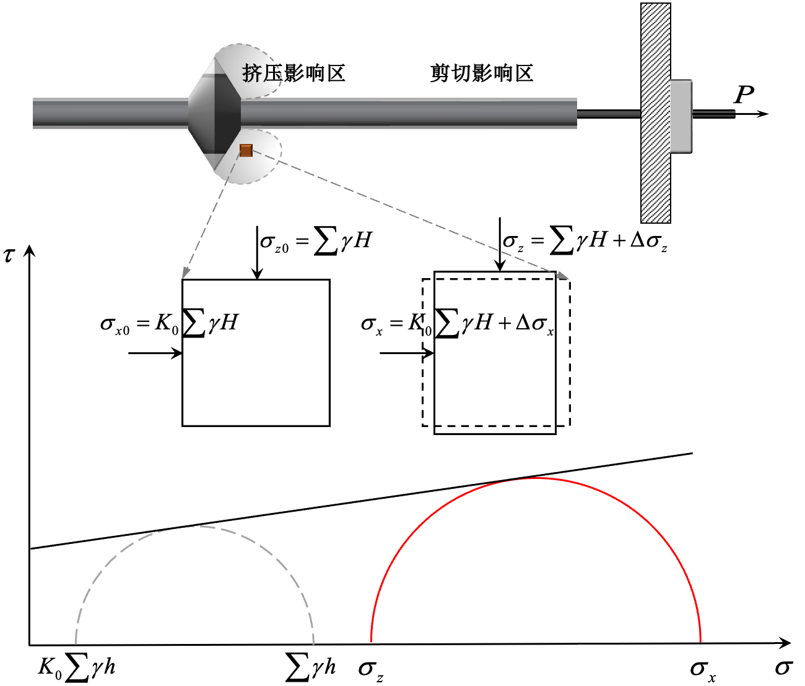

支盘式锚杆是通过自主研发的扩孔设备在指定土层形成支盘状空腔，然后注浆形成多支盘锚固体结构。相较于传统锚索、扩大头锚杆具有以下优点：

- 抗拔承载力高——有限锚杆长度
- 鲁棒性强——多个支盘
- 灵活性强——可选择工程性能良好的土层形成支盘

  

---
{}

盘径与极限承载力呈线性增长关系， 不同支盘直径 $D$ 的锚杆较直锚杆的极限承载力提高了 2～5 倍，说明盘径对抗拔承载力的影响最为显著。随着双支盘间距的增大，极限抗拔承载力也逐步加大，当分界间距为 4 倍支盘直径时，可充分调用双支盘的承载力。
{}

  

{}
支盘式锚杆的埋置深度与极限承载力呈非线性增加，当埋深达到 500 mm 后极限承载力变化幅度逐步降低（存在临界埋深）；埋深比与荷载系数关系曲线的斜率突变点为临界埋深比，$(H/D)_{\mathrm{CR}}$ =3.02。
{}

描述锚杆的支盘埋置深度对极限抗拔力的影响，无量纲荷载系数 $N_{\mathrm{pf}}$ 定义为:

$$
N_{\mathrm{pf}}=P_\mathrm{f}/AK_0\gamma H
$$
式中：$P_\mathrm{f}$ 为锚杆的极限拉拔力； $A$ 为支盘面积（ $A=\pi R^2$ ）； $K_0$ 为支盘前土体的静止土压力系数；$H$ 为支盘埋置的深度；$\gamma$ 为上覆土的重度。

  

{}
随着拉拔力的增加，盘端土体产生压缩挤密作用，锚杆轴向土体应力转化为第一主应力并达到极限压力，盘端阻力显著增加，推导得出的支盘式锚杆极限承载力计算公式与试验结果基本一致，验证了计算公式的有效性。
{}

支盘锚杆的承载力主要有两部分组成：支盘端阻力与锚固段的侧阻力。极限承载力可表示为

$$
P_\mathrm{f}=P_\mathrm{s}+Q
$$

$$
P_\mathrm{s}=\pi d(L-L_\mathrm{p})q_\mathrm{s}
$$

盘端阻力 $Q$ 可表示为
$$
Q=\frac{\pi(R^2-r^2)\left[(1-\xi)K_0K_\mathrm{P}\sum\gamma H+2c\sqrt{K_\mathrm{P}}\right]}{(1-\xi K_\mathrm{P})\tan\theta}
$$

  

