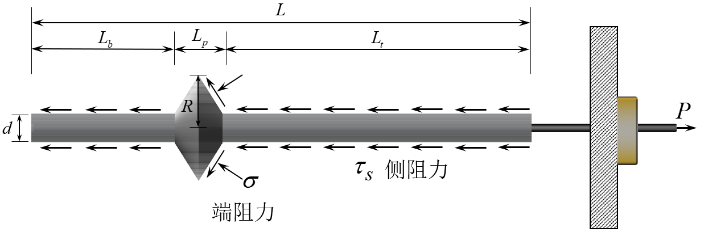
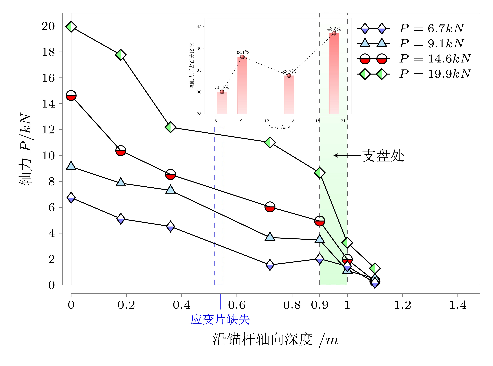
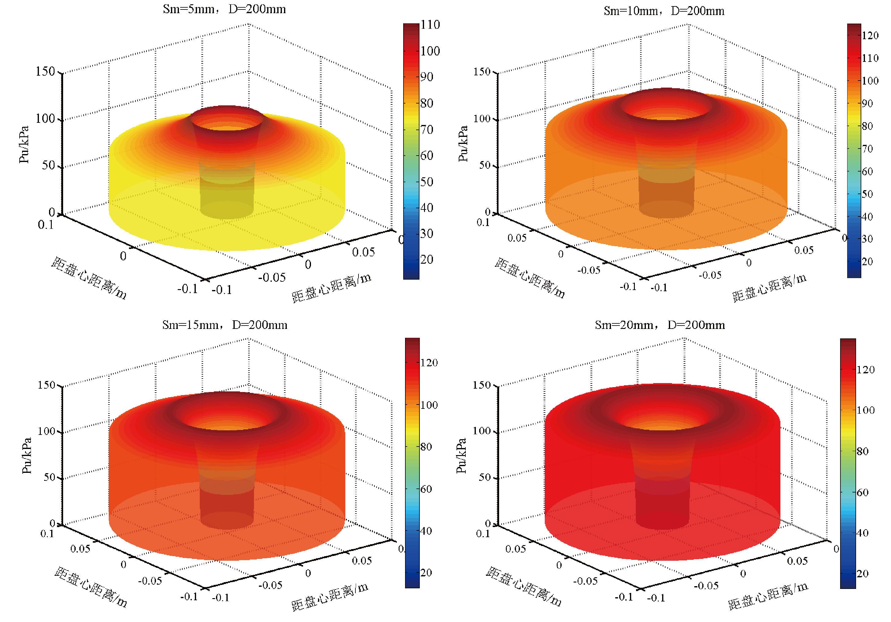

支盘式锚杆的承载力主要有两部分组成：支盘端阻力与锚固段的侧阻力。在拉拔试验加载过程中，支盘与土体的相互作用与静力触探试验的锥头相似，土体挤压变形引起盘周围土体的径向位移，同时压缩挤密盘端土体（塑性区不断向外延伸发展），提高了支盘式锚杆的抗拔承载力。

  

---
{}

相较于普通锚杆，支盘式锚杆的抗拔承载力得到了显著提高，其荷载-位移曲线可划分为3个阶段，支盘端土体塑性区随荷载增加不断向外延伸发展，当支盘达到极限强度时破裂失效，位移急剧增加，轴力分布沿锚固体深度呈减小趋势且在支盘处发生台阶状突变，荷载比也不断增长。
{}

<!-- 

  

  

 -->

  

  

---

{}
在试验模型基础上探讨支盘式锚杆力学模型,通过借鉴静力触探试验锥阻力的计算方法,引用经典的 VESIC 扩孔理论模拟支盘拉拔过程中的挤土效应,推导出了盘端阻力的计算理论式。
{}

  

当$r_{0}\leq r_{x}\leq(s_{m}\tan(\theta)+r_{0})$时：

$$
P_u=Ccot\varphi(1+sin\varphi){\left[\frac{G(1+\Delta-(\frac{r_0}{r_x})^2)}{Ccos\varphi+G\Delta}\right]}^{\frac{sin\varphi}{1+sin\varphi}}-Ccot\varphi 
$$

当$(s_m\tan(\theta)+r_0)\leq r_x\leq R$时：

$$
P_u=Ccot\varphi(1+sin\varphi)\left[\frac{G(1+\Delta-(\frac{r_x-s_m\tan(\theta)}{r_x})^2)}{Ccos\varphi+G\Delta}\right]^{\frac{sin\varphi}{1+sin\varphi}}-Ccot\varphi 
$$

---
{}
锚-土界面选用双曲线非线性模型，采用分段变形协调迭代算法建立了荷载传递计算模型，计算所得结果与实测数据基本一致。
{}

---
{}
支盘的极限扩孔压力沿支盘径向先快速非线性增长后缓慢减小，其峰值随着位移增大而增大并以支盘中心为圆点径向外移，整体分布由“锥台状”发展为“圆柱状” 。支盘的挤扩角大于 50°时，对锚杆承载性状影响显著。
{}

  

  

