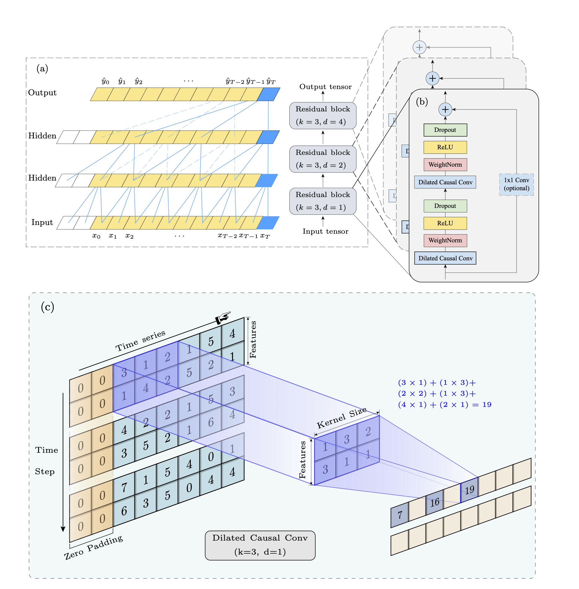

  

TCN 是基于传统一维 CNN 的一个简单但强大的扩展，具有以下三个特性：
- 输出序列与输入序列具有相同的长度；
- 当前时间 $t$ 的预测结果只与历史信息相关，从未来到过去不可能有信息泄漏；
- 通过使用扩张卷积，感受野以及有效记忆随着网络深度的增加呈指数增长。可以抓取滑坡演化过程中更长的历史时间序列依赖信息，提高滑坡位移预测精度。

  

{}
针对滑坡的复杂动力学机制与非线性演化特征，所提出的 BO-TCN 模型在训练过程中有效避免了基于位移分解方法所固有的“未来数据泄露”风险。预测结果显示，该模型在多项评价指标（MAE、MSE、RMSE 与 R2）上均取得最优表现，显著优于现有的滑坡位移预测模型，具有较高的实用性与推广价值。
{}

{}
与静态机器学习模型（BO-RF、BO-SVM）相比，BO-TCN 能够更好地刻画滑坡位移的时变非线性规律，在动态预测任务中表现出明显优势。同时，与传统的深度学习模型（1D-CNN、LSTM、GRU）相比，BO-TCN 在捕捉尧山滑坡阶梯状变形阶段的响应特征方面具有更强的泛化能力和预测稳定性。研究结果表明，通过对降雨与孔隙水压力的实时监测并结合该模型，可实现滑坡再激活阶段的提前识别与预警。
{}

